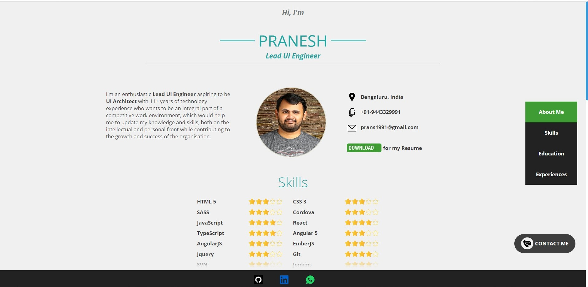

# react-profile-component

React profile component can be used to display different sections of your Profile/ Portfolio page.

## Getting started
```bash
npm install --save react-profile-component
```



Complete example, coming soon!
